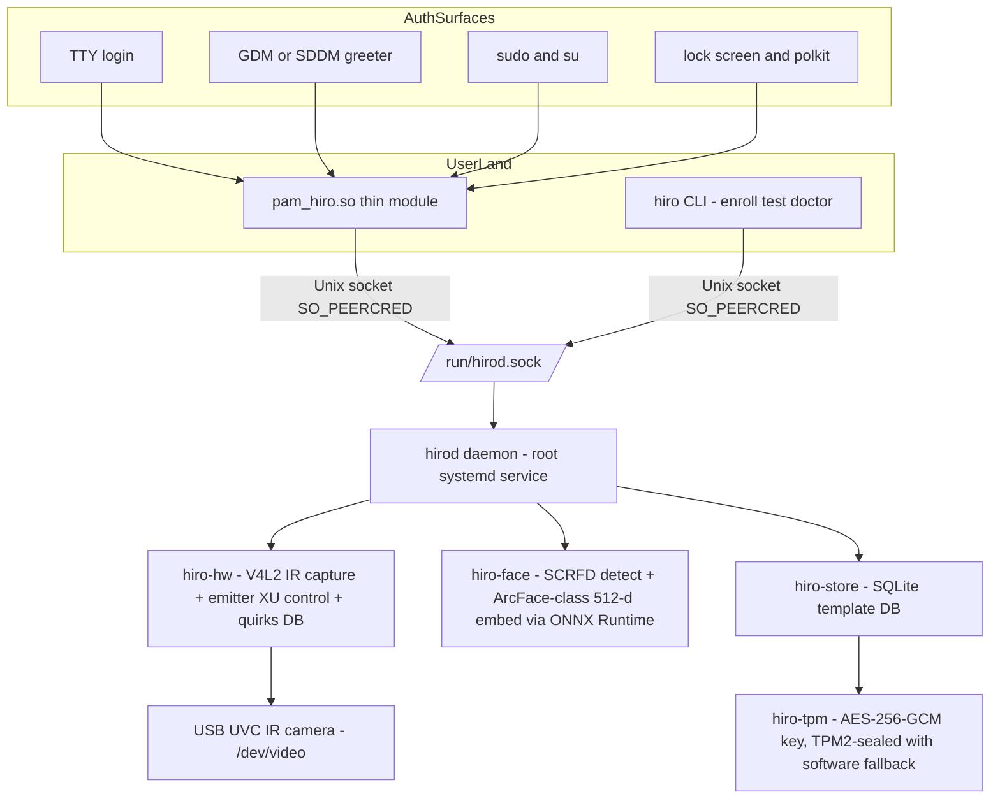
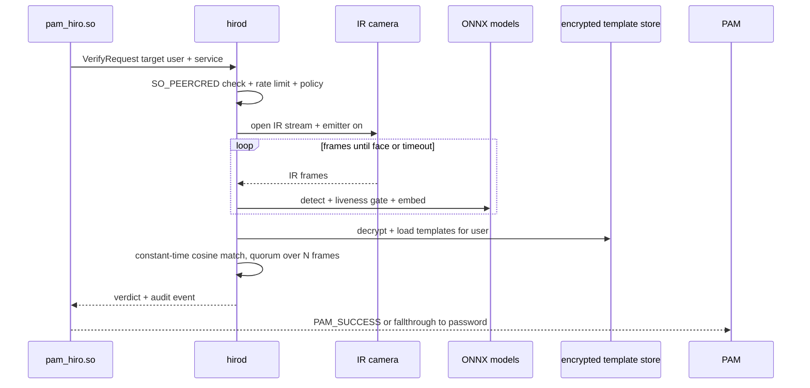

# HIRO — Linux Face-Authentication Provider (Windows Hello IR Camera)

Status: APPROVED PLAN — authored by planning agent, session ses_ff49b9423ffelkmeIO74YVUkKh, 2026-08-16

## 1. Mission

A Windows Hello-style biometric authentication provider for Linux that uses the
laptop's built-in Windows Hello IR camera to authenticate against PAM — TTY
login, display-manager greeter (GDM/SDDM), lock screen, sudo/su, and polkit
prompts. Hardened by design: IR-only enforcement, anti-spoof liveness,
encrypted templates (TPM-sealed where available), rate limiting, and audit
logging.

## 2. Locked-in decisions

| Decision | Choice | Rationale |
| --- | --- | --- |
| Language | Rust | Memory safety across the entire authentication path; mature crates for v4l2, ONNX Runtime, PAM, TPM2, SQLite |
| Camera stack | USB UVC IR camera under uvcvideo (V4L2 /dev/video*) | Best-supported Windows Hello IR class; Intel IPU6/MIPI and RealSense are explicitly out of scope (stretch goals) |
| Auth surfaces | Full PAM: login, greeter, lock screen, sudo/su, polkit | One PAM module, `auth sufficient` placement |
| Security tier | Hardened authenticator | IR-only, liveness, encrypted templates, TPM2 when available, rate limiting, audit logs |
| Architecture | Privileged warm daemon + thin PAM module | Sub-second auth (~200-300 ms), models preloaded, camera owned once; the pattern proven by visage/howdy-style successors |
| IPC | Unix socket at /run/hirod.sock, SO_PEERCRED-authenticated | Fewer moving parts than D-Bus; works in early-boot/greeter/polkit contexts; daemon re-verifies authorization server-side |
| Distro targets | Ubuntu/Debian first (deb + pam-auth-update profile); Arch/Fedora as follow-up milestones | pam-auth-update gives clean opt-in integration |

## 3. Architecture

### Verification sequence

## 4. Cargo workspace crates

- `hiro-core` — shared types, config parsing (/etc/hiro/config.toml), errors, versioned IPC protocol, constant-time embedding math via `subtle`.
- `hiro-hw` — camera discovery (enumerate /dev/video* under uvcvideo, classify IR nodes via UVC descriptors/XU GUIDs), V4L2 mmap capture via `v4l` crate (prefer YUYV 640x480 or 640x360 @ 30 fps), IR emitter activation via UVC extension-unit control with `linux-enable-ir-emitter` fallback, per-VID:PID quirks DB, camera pinning (bus path + VID:PID recorded at enrollment), frame preprocessing for the models.
- `hiro-face` — ONNX Runtime (`ort` crate): SCRFD (MIT) face detection, 5-landmark alignment to 112x112, AuraFace (Apache-2.0, ArcFace-compatible 512-D) embeddings; model manifest with pinned SHA-256 verified at every load; CPU provider default, OpenVINO/CUDA/ROCm optional later.
- `hiro-store` — SQLite (rusqlite) schema for users, face models, enrollment metadata (angles, quality, timestamp); per-user ACLs.
- `hiro-tpm` — key management: TPM2 (tss-esapi) sealed AES-256-GCM data-encryption key with software-KDF fallback (root-only 0600 keyfile, loud warning when no TPM); encrypts embeddings before SQLite persistence.
- `hirod` — privileged daemon binary: owns camera, models, templates, TPM key; Unix socket server; endpoints: verify, enroll, status, list, remove, clear, reload, prewarm; rate limiting (e.g. 5 attempts/user/60 s + cooldown), audit logging to journald/syslog, camera pinning checks, suspend/resume re-init; systemd hardening (ProtectSystem=strict, NoNewPrivileges, RestrictAddressFamilies=AF_UNIX, DeviceAllow=char-video4linux).
- `pam-hiro` — thin PAM module (cdylib `pam_hiro.so`, libpam-sys): reads PAM_USER + service name, calls daemon with short timeout, maps verdicts to PAM statuses (match -> PAM_SUCCESS; no-match -> PAM_AUTH_ERR; camera unavailable -> PAM_AUTHINFO_UNAVAIL; error/timeout -> PAM_SYSTEM_ERR), so password fallback always works; never touches the camera itself.
- `hiro-cli` — `hiro` CLI: enroll (guided multi-angle capture: center, up, down, left, right, tilt, with quality gates on face size, sharpness, frame variance), list/remove/clear, test, doctor (hardware + emitter + model-integrity diagnostics), man pages.

## 5. Security model

- IR-only enforcement (`require_ir = true` by default; RGB nodes refused for auth).
- Anti-spoof liveness gate: frame variance over time, landmark micro-motion, optional passive blink (M7); IR inherently resists screen replay.
- No images persisted anywhere — only encrypted 512-D embeddings.
- Constant-time embedding comparison; enrollment embeddings encrypted AES-256-GCM under TPM2-sealed key when available.
- Camera pinning: authentication refused if camera identity differs from enrollment.
- Daemon-side authorization: request allowed when caller is root (CLI) or caller uid equals target PAM_USER uid; rate limiting + audit for every verdict; model files SHA-256 pinned at every load; zero network access at runtime.
- Fail closed: any daemon/IPC error degrades to password, never to PAM_SUCCESS.
- PAM placement: `auth sufficient pam_hiro.so` (before password module); always opt-in via pam-auth-update or explicit stack edit.

## 6. Milestones / todo list

- M0 — Workspace bootstrap: cargo workspace + 8 crate skeletons, CI (fmt/clippy/test), README, this plan file.
- M1 — Hardware discovery spike on target laptop: enumerate /dev/video*, confirm IR node under uvcvideo, emitter behavior; document in docs/hardware.md.
- M2 — hiro-hw: V4L2 capture, IR node auto-detection, emitter XU control + fallback, quirks DB, camera pinning, `hiro doctor`.
- M3 — hiro-face: ONNX Runtime SCRFD + AuraFace, model manifest with pinned SHA-256, alignment/preprocessing, unit tests + benchmarks.
- M4 — hiro-store + hiro-tpm: SQLite schema, TPM2-sealed AES-256-GCM with software fallback, constant-time matcher, per-user ACLs.
- M5 — hirod daemon: Unix socket IPC + SO_PEERCRED authz, verify/enroll/status endpoints, rate limiting + lockout, audit logging, systemd units (hirod.service + hirod-resume.service), hardening.
- M6 — pam-hiro: PAM module, verdict mapping, `sufficient` semantics, deb pam-auth-update profile, integration tests with pamtester across sudo, TTY login, lock screen.
- M7 — hiro CLI: enroll UX with quality gates, list/remove/clear/test/doctor, man pages; deb packaging (postinst wiring, systemd units, udev rule, polkit >= 127 systemd drop-in).
- M8 — Hardening and polish: liveness improvements (micro-motion, passive blink), optional keyring unlock via TPM-sealed login password (pam_gnome_keyring / pam_kwallet), OpenVINO/CUDA providers, IPC fuzzing, Arch/Fedora packaging.

## 7. Known risks and mitigations

- ArcFace-class models trained on RGB show a domain gap on IR frames: mitigate with enrollment quality gates, per-user threshold calibration, optional IR-adapted weights later.
- Emitter XU control varies by vendor: mitigate with per-VID:PID quirks DB and linux-enable-ir-emitter fallback.
- polkit >= 127 sandboxes its PAM helper: mitigate with systemd drop-in (PrivateDevices=no, DeviceAllow for /run/hirod.sock).
- Greeter contexts run PAM as a service user (e.g. gdm): mitigate with daemon-side rule — allow root callers and caller==target-user callers.
- Suspend/resume can leave the camera dead: mitigate with hirod-resume.service restart.
- Intel IPU6 / MIPI laptops are NOT supported by this plan; they need libcamera + Intel HAL — a separate future milestone.

## 8. Out of scope (stretch goals)

Intel IPU6/MIPI cameras, RealSense depth cameras, RGB-only convenience tier, remote/SSH biometrics, multi-factor orchestration beyond standard PAM stacking.

## 9. Implementation status (2026-08-16)

| Milestone | Status |
| --- | --- |
| M0 workspace bootstrap | Done — 8 crates, CI, README |
| M1 hardware discovery | Done — `hiro doctor`; validated against a Logitech BRIO IR node (`cargo test -p hiro-hw --test hardware -- --ignored`) |
| M2 hiro-hw capture + emitter | Done — V4L2 mmap capture, IR heuristics, XU quirks DB, `linux-enable-ir-emitter` fallback |
| M3 hiro-face pipeline | Done — SCRFD decode + NMS, landmark alignment, ArcFace-class embedding via ONNX Runtime; deterministic stub pipeline for tests |
| M4 store + key management | Done — SQLite encrypted templates; AES-256-GCM; TPM2-sealed keys (tss-esapi) with software fallback |
| M5 hirod daemon | Done — Unix socket + SO_PEERCRED, rate limiting, lockout, liveness gate, camera pinning, audit, systemd hardening, suspend/resume |
| M6 pam-hiro | Done — fail-closed `sufficient` module, deb pam-auth-update profile, pamtester guidance |
| M7 CLI + packaging | Done — enroll/list/remove/clear/test/snapshot/doctor/status; deb builder, PKGBUILD, Fedora spec, polkit >= 127 drop-in |
| M8 hardening pass | Partial — liveness + pinning + TPM done; keyring unlock, GPU providers, IPC fuzzing open |

